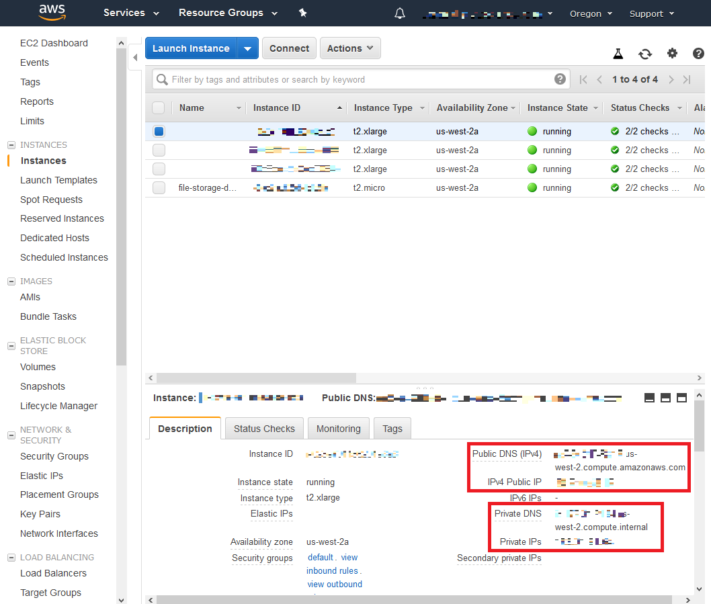
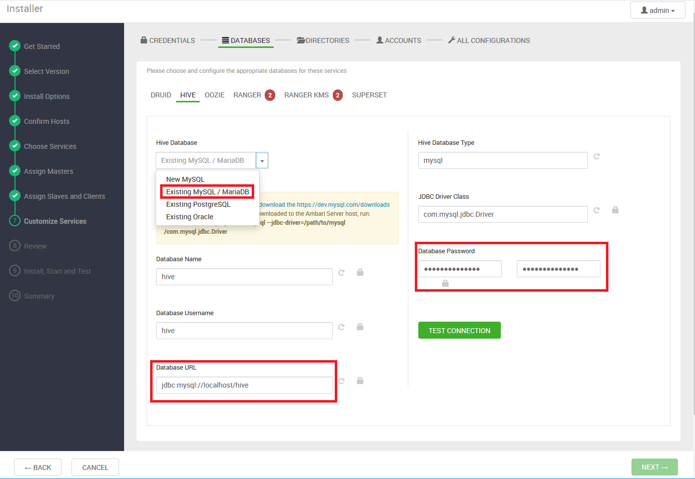

This documentation applies to following environment, and may or may not work in another environment.
* AWS EC2 Instances with the image Red Hat Enterprise Linux 7.5 (HVM), SSD Volume Type - ami-28e07e50
* AWS EC2 Instances with at least 30 GB disk space
* AWS EC2 Instances with at least 16 GB memory

# Prerequisites
AWS instance(s) has/have been launched and running https://github.com/ccbt87/docs/tree/master/AWS_launch_instance

# 1. Configure Instance(s), and Install Ambari
1. Sign In to the AWS Management Console. Go to `Services` -> `EC2` -> `Instances`. Find the `Public_IP`, `Public_DNS`, `Private IP`, and `Private DNS` for each instance in the `Description` by selecting the instance

2. Upload the scripts to one instance. Or have one dedicated instance which does not belong to the cluster to store the scripts. (Currently, the scripts are stored in the free-tier instance)

* The MySQL database password for Hive, Ranger, Schema Registry, Streaming Analytics Manager, and Superset were set in the script file `preconfig-ambari-4-hdphdf.sh`.
* You will need to enter these passwords in the step 2.7 if you select the corresponding service in the step 2.4.
* If you want to change the password, change it before executing the script `./hdphdf.sh`

3. SSH to the instance that stores the scripts. Write the `Private IP` and `Private DNS` to the `hosts` file using the format `Private_IP Private_DNS` just like a normal host file. For example: `1.2.3.4 ec2-1-2-3-4.us-west-2.compute.amazonaws.com`

* The first instance you put in the hosts file will be the host of Ambari Server and MySQL database.

4. Execute the script `./hdphdf.sh` and wait for the script to complete

# 2. Install, Configure, and Deploy a Cluster
Once you get the message `Ambari Server 'start' completed successfully`, open `http://<the Public_IP or Public_DNS of the first instance you put in the hosts file in the step 1.3>:8080` in web browser. Log in to the Ambari Server using the default username/password: `admin/admin`

Click `LAUNCH INSTALL WIZARD`

## 2.0. Get Started
Enter a cluster name. Click `NEXT`

## 2.1. Select Version
If there is a local repository available, select `Use Local Repository`, fill in the `Base URL` of the local repository, and click `NEXT`. Otherwise click `NEXT` directly.

## 2.2. Install Options
Fill in the `Private DNS` to the `Target Hosts`. Add the `SSH Private Key` by clicking on `CHOOSE FILE`. Change the `SSH User Account` to `ec2-user`. Click `REGISTER AND CONFIRM`

## 2.3. Confirm Hosts
Once the host registration is done and all host checks passed. Click `NEXT`

## 2.4. Choose Services
Choose desired services, and click `NEXT`. For demonstration purposes, this example chose all of the available services. Selecting everything requires a large amount of hardware resources especially the memory. Insufficient resources may lead to the failure of installation and testing.

## 2.5. Assign Masters
Assign Masters, and click `NEXT`. For demonstration purposes, this example did not change the default assignment.

## 2.6. Assign Slaves and Clients
Assign Slaves and Clients, and click `NEXT`. For demonstration purposes, this example did not change the default assignment.

## 2.7. Customize Services
### CREDENTIALS
  * set password for services, and click `NEXT`

  

### DATABASES
  1. Go to `HIVE`. Select `Existing MySQL / MariaDB` in `Hive Database`. Put `hive` to `Database Password` if it has not been changed in the script file `preconfig-ambari-4-hdphdf.sh`. In `Database URL`, replace the URL with the `Private IP` or `Private DNS` of the first instance in the `hosts` file in the step 1.1.  

  

  2. Go to `RANGER`. Put the `Private IP` or `Private DNS` of the first instance in the `hosts` file in the step 1.1 to `Ranger DB host`. Put `rangerdba` to `Database Administrator (DBA) username` and `Database Administrator (DBA) password` if it has not been changed in the script file `preconfig-ambari-4-hdphdf.sh`

  

  3. Go to `RANGER KMS`. Put the `Private IP` or `Private DNS` of the first instance in the `hosts` file in the step 1.1 to `Ranger KMS DB host`. Put `rangerdba` to `Database Administrator (DBA) username` and `Database Administrator (DBA) password` if it has not been changed in the script file `preconfig-ambari-4-hdphdf.sh`

  

  4. Go to `SUPERSET`. Select `MYSQL` in `Superset Database type`. Put `superset` to `Superset Database password` if it has not been changed in the script file `preconfig-ambari-4-hdphdf.sh`. Put the `Private IP` or `Private DNS` of the first instance in the `hosts` file in the step 1.1 to `Database hostname`.

  

  * Click `NEXT`

### DIRECTORIES
  * Click `NEXT`. For demonstration purposes, this example did not change the default configuration.

### ACCOUNTS
  * Click `NEXT`. For demonstration purposes, this example did not change the default configuration.

### ALL CONFIGURATIONS
  1. Go to `NIFI`. Expand `Advanced nifi-ambari-config`. Set password for `Encrypt Configuration Master Key Password` and `Sensitive property values encryption password`

  

  2. Go to `NIFI REGISTRY`. Expand `Advanced nifi-registry-ambari-config`, and set password for `Encrypt Configuration Master Key Password`. Expand `Advanced nifi-registry-properties`, and set password for `nifi.registry.db.password`

  

  3. Go to `SCHEMA REGISTRY`. Put `registry` to `storage password` if it has not been changed in the script file `preconfig-ambari-4-hdphdf.sh`. In `Database Host with Port`, replace `localhost` with the `Private IP` or `Private DNS` of the first instance in the `hosts` file in the step 1.1.

  

  4. Go to `STREAMING ANALYTICS MANAGER`. Put `streamline` to `storage password` if it has not been changed in the script file `preconfig-ambari-4-hdphdf.sh`. In `Database Host with Port`, replace `localhost` with the `Private IP` or `Private DNS` of the first instance in the `hosts` file in the step 1.1.

  

  * If there are extra required configurations, check the bell and edit the property accordingly. Otherwise, click `NEXT`

  

## 2.8. Review
Review the configurations. If everything is correct, click `DEPLOY`

## 2.9. Install, Start and Test
Ambari will install the services first, then start and test the services.

If it failed to install one of the service, it will show `Failures encountered`. You can click on the message to check the details, fix the problem and click on `RETRY` to retry.

If it failed to start or test one of the service, it will show `Warning encountered`. And it is not possible to retry. You have to note down the details of the warning and proceed. You may run a service check afterward in the Ambari Dashboard for the service that produced the warning message.

Click `NEXT`
## 2.10. Summary
Click `COMPLETE` will bring you to the Ambari Dashboard.

