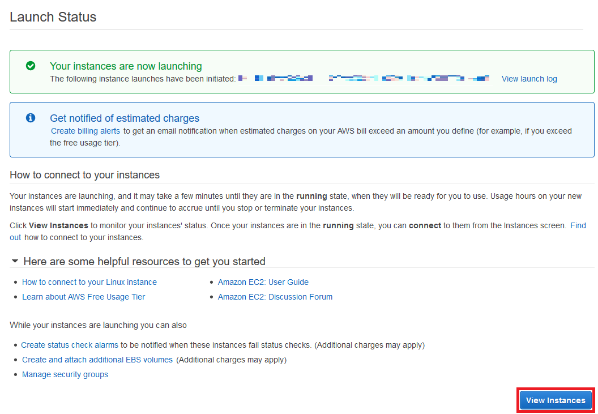

# Prerequisites
AWS account with sufficient authorization

# 1. Launch Instance
1. Sign In to the AWS Management Console
2. Go to `Services` -> `EC2`

3. Click `Launch Instance`

    1. `Select` desired Operating System.
      * RHEL and SLES are more expensive than other Linux such as CentOS and Ubuntu.
    
    2. Choose an desired Instance Type. Click `Next: Configure Instance Details`
    
    3. Set desired `Number of instances` and `Subnet`. Click `Next: Add Storage`
    
    4. Set desired Storage size and type. Click `Next: Add Tags`
    
    5. Skip adding tags. Click `Next: Configure Security Group`
    
    6. Create a desired security group or select an existing security group. Click `Review and Launch`
    
    7. Review and click `Launch`
    
    8. Select an existing key pair or create a new key pair. Check the checkbox and click `Launch Instance`
    

# 2. View Instance(s)
Click `View Instance` or go to `Services` -> `EC2` -> `Instances`.

# What you can do next
* Deploy a HDP/HDF cluster https://github.com/ccbt87/docs/tree/master/AWS_deploy_HDP_HDF_cluster_using_Ambari
* Deploy a Cassandra cluster
