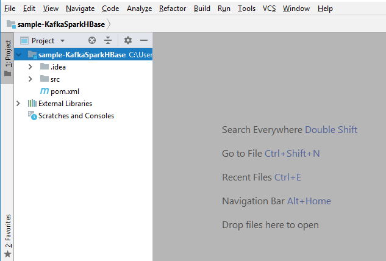

# Spark Development Environment Setup with Java and Maven

## Prerequisites
* Installed JDK
* Installed IntelliJ IDEA
* Installed Maven (Bundled Maven comes with the IDEA)
* Installed Docker

## Creating IntelliJ Project
NOTE: Instructions may vary. This tutorial uses IntelliJ Version: 2018.2.4 on Windows 10 1803.

Create a new project by selecting File > New > Project, or Create New Project on the IntelliJ IDEA Welcome window. Then select Maven, set JDK version and click Next.


Specify the GroupId, ArtifactId and Version, then click Next.


Name the project and select location, then click Finish.


IntelliJ should make a new project with a default directory structure.



## Change IntelliJ Settings

OPTIONAL: To use different Maven version, go to File > Settings > Build, Execution, Deployment > Build Tools > Maven. Change the Maven home directory.


Go to File > Settings > Build, Execution, Deployment > Build Tools > Maven > Importing. Verify that `import Maven projects automatically` is Checked.


Go to File > Project Structure > Project. Verify Project SDK and Project language level are set to Java version.


Go to File > Project Structure > Modules. Verify Language level is set to Java version.


## Import Libraries and Write Code

Open the pom.xml file in the project directory.

For demo purpose, copy everything from https://github.com/ccbt87/sample-KafkaSparkHBase/blob/master/pom.xml to it.


Select the folder `src/main/java` in the project directory. Right-click on folder and select New > Java Class. Name the class: KafkaSparkHBase.java


For demo purpose, copy everything from https://github.com/ccbt87/sample-KafkaSparkHBase/blob/master/src/main/java/KafkaSparkHBase.java to it.


NOTE: Do not worry about the red lines for now.

## Setup Test Environment
Memory Configuration for

Pull the Docker image https://hub.docker.com/r/ccbt87/aio/
```
docker pull ccbt87/aio
```
Following components were included in this Docker image:

| Component | Version | Binary Location | Port |
| --- | --- | --- | --- | --- |
| Kafka | 1.1.1 | /opt/kafka_2.11-1.1.1 | Listener 6667 |
| Spark* | 2.3.1 | /opt/spark-2.3.1-bin-hadoop2.7 | Master Web UI 8080 <br> Worker Web UI 8081 <br> Master 7077 |
| HBase | 2.0.0 | /opt/hbase-2.0.0 | Master 16010 |
| Zookeeper* | 3.4.10 | | Client Port 2181 |
| Cassandra | 3.11.3 | /opt/apache-cassandra-3.11.3 | Client Port 9042 |
| NiFi | 1.7.0 | /opt/nifi-1.7.0 | Web UI 9090 |

This Docker image uses the Oracle JDK version: 1.8.0_112 (JAVA_HOME=/opt/jdk1.8.0_112)

\* The Spark is pre-built for Hadoop version 2.7.3 which does not align with the Hadoop version 3.1.1 in HDP 3.0.1 and HDF 3.2.0

\* The Zookeeper version 3.4.10 comes within the HBase standalone mode does not align with the Zookeeper version 3.4.6 in HDP 3.0.1 and HDF 3.2.0

Before running the image, adjust the memory limit to 4 - 8 GB in advanced settings of the Docker for Mac or Windows (No configuration needed for Linux)

Run the image
```
docker run --hostname aio --name aio -it ccbt87/aio
```
Specify the hostname and the name for the container as needed. If not specified, a short form of UUID will be used as both of the hostname and container name. For demo purpose, this tutorial use `aio` for both names.

NOTE: Docker for Mac and Windows cannot route traffic to Linux containers. Use following workarounds if needed:
* To connect to a container from the Mac or Windows, run the image using either one of the following commands and then use localhost:{port} to access the service in container.
  * Use `-p` or `--publish` to publish ports on the container to specific ports on the host.
  ```
  docker run --hostname aio --name aio -it -p 2181:2181 -p 6667:6667 -p 7077:7077 -p 8080:8080 -p 8081:8081 -p 9042:9042 -p 9090:9090 -p 16010:16010 ccbt87/aio
  ```
  * Use `-P` to exposes pre-defined ports on the container to random ports on the host. (Ports 2181 6667 7077 8080 8081 9042 9090 16010 were defined in the Dockerfile when building this Docker image)
  ```
  docker run --hostname aio --name aio -it -P ccbt87/aio
  ```

* To connect from a container to a service on the host

  * The host has a changing IP address (or none if it has no network access). From Docker 18.03 onwards the recommendation is to connect to the special DNS name `host.docker.internal`, which resolves to the internal IP address used by the host. This is for development purpose and will not work in a production environment outside of Docker for Mac or Windows.
  * The gateway is also reachable as `gateway.docker.internal`.

To remove the running container, stop the container first:
```
docker stop aio
```
Then
```
docker rm aio
```
To remove the image, remove any referenced containers first, then
```
docker rmi ccbt87/aio
```

## Create jar and Deploy to the Test Environment

Go to Maven Projects > {Project Name} > Lifecycle. Double click on package. This will create a compiled jar under target in the project directory.


NOTE: The red lines should disappear after you close and reopen the IntelliJ IDEA.

Copy the jar file to the docker container
```
docker cp ~/sample-KafkaSparkHBase-1.0-SNAPSHOT.jar aio:/root/
```

In the docker container, use spark-submit to run the Spark job.
```
/opt/spark-2.3.1-bin-hadoop2.7/bin/spark-submit --class KafkaSparkHBase /root/sample-KafkaSparkHBase-1.0-SNAPSHOT.jar
```

## References
https://hortonworks.com/tutorial/setting-up-a-spark-development-environment-with-java/

https://github.com/ccbt87/sample-KafkaSparkHBase

https://docs.docker.com/docker-for-mac/networking/
