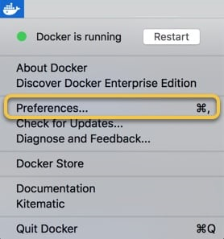
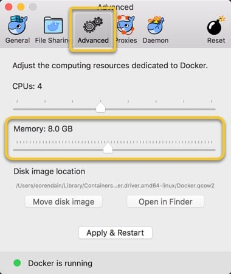

# Spark Local Development Environment Setup with Java and Maven
<!-- TOC depthFrom:1 depthTo:6 withLinks:1 updateOnSave:1 orderedList:0 -->

- [Spark Local Development Environment Setup with Java and Maven](#spark-local-development-environment-setup-with-java-and-maven)
	- [1. JDK Setup](#1-jdk-setup)
		- [1.1 Download JDK](#11-download-jdk)
		- [1.2 Install JDK](#12-install-jdk)
	- [2. IDE Setup](#2-ide-setup)
		- [2.1 Download and Install IntelliJ IDEA](#21-download-and-install-intellij-idea)
			- [Windows 10/8/7/Vista/2003/XP (incl.64-bit)](#windows-1087vista2003xp-incl64-bit)
			- [MacOS 10.8.3 or higher](#macos-1083-or-higher)
			- [Linux GNOME or KDE desktop](#linux-gnome-or-kde-desktop)
		- [2.2 Create IntelliJ Project](#22-create-intellij-project)
		- [2.3 Change IntelliJ Settings](#23-change-intellij-settings)
		- [2.4 Import Libraries](#24-import-libraries)
		- [2.5 Write Code](#25-write-code)
		- [2.6 Create Fat Jar](#26-create-fat-jar)
	- [3. Docker Setup](#3-docker-setup)
		- [3.1 Download and Install Docker](#31-download-and-install-docker)
			- [Windows 10 64bit: Pro, Enterprise or Education (1607 Anniversary Update, Build 14393 or later)](#windows-10-64bit-pro-enterprise-or-education-1607-anniversary-update-build-14393-or-later)
			- [MacOS El Capitan 10.11 and newer](#macos-el-capitan-1011-and-newer)
			- [Linux (OS requirement varies)](#linux-os-requirement-varies)
		- [3.2 Memory Configuration](#32-memory-configuration)
			- [Windows](#windows)
			- [MacOS](#macos)
			- [Linux](#linux)
		- [3.3 Pull Image from Docker Hub](#33-pull-image-from-docker-hub)
		- [3.4 Run the Image to Create Docker Container](#34-run-the-image-to-create-docker-container)
			- [Windows or Mac](#windows-or-mac)
			- [Linux](#linux)
	- [4. Run the Sample Spark Job](#4-run-the-sample-spark-job)
		- [4.1 Create Kafka Topic](#41-create-kafka-topic)
		- [4.2 Create HBase Table](#42-create-hbase-table)
		- [4.3 Copy Jar File to Container and Submit to Spark](#43-copy-jar-file-to-container-and-submit-to-spark)
		- [4.4 Publish Data to Kafka](#44-publish-data-to-kafka)
		- [4.5 Check Results in HBase](#45-check-results-in-hbase)
	- [5. Live Debugging (Not working)](#5-live-debugging-not-working)
	- [Docker Toolbox Setup](#docker-toolbox-setup)
	- [VirtualBox Setup](#virtualbox-setup)
	- [VMware Setup](#vmware-setup)
	- [References](#references)
	- [Appendix](#appendix)
		- [Appendix A - Docker Image Info](#appendix-a-docker-image-info)
		- [Appendix B - Known Issues](#appendix-b-known-issues)
			- [1. HBase Master, HBase RegionServer, ZooKeeper, or Kafka Stop Working After Restart the Docker Container](#1-hbase-master-hbase-regionserver-zookeeper-or-kafka-stop-working-after-restart-the-docker-container)
				- [Symptom](#symptom)
				- [Cause](#cause)
				- [Solution](#solution)
				- [Workarounds](#workarounds)
			- [2. Port mapping won't persist if a container restarts? (Need confirmation)](#2-port-mapping-wont-persist-if-a-container-restarts-need-confirmation)

<!-- /TOC -->
NOTE: Instructions may vary. This tutorial is based on following environment:

* Windows 10 1803
* JDK 8u112
* IntelliJ IDEA 2018.2.4
* Maven 3.3.9 (The bundled version comes within the IDEA)
* Docker 18.06.1-ce

## 1. JDK Setup

### 1.1 Download JDK

Go to https://www.oracle.com/technetwork/java/javase/downloads/java-archive-javase8-2177648.html

Sign in with your Oracle Account. If you don't have one, create an account first

Find Java SE Development Kit 8u112

Select `Accept License Agreement`

Click on the download link that matches your OS


### 1.2 Install JDK


## 2. IDE Setup

### 2.1 Download and Install IntelliJ IDEA
Select and download the installation package that matches your OS from the official website: https://www.jetbrains.com/idea/download

#### Windows 10/8/7/Vista/2003/XP (incl.64-bit)
* Run the IDEA `idea-{version}.exe` file that starts the Installation Wizard.
* Follow all steps suggested by the wizard.

#### MacOS 10.8.3 or higher
* Download the `idea-{version}.dmg` macOS Disk Image file.
* Mount it as another disk in your system.
* Copy IntelliJ IDEA to your Applications folder.

#### Linux GNOME or KDE desktop
* Unpack the IDEA `idea-{version}.tar.gz` file using the following command:
```
tar -xzf idea-{version}.tar.gz
```
* Run `idea.sh` from the bin subdirectory.

### 2.2 Create IntelliJ Project

Launch the IntelliJ IDEA.

Create a new project by selecting File > New > Project, or Create New Project on the IntelliJ IDEA Welcome window. Then select Maven, set JDK version and click Next.


Specify the GroupId, ArtifactId and Version, then click Next.


Name the project and select location, then click Finish.


IntelliJ should make a new project with a default directory structure.


### 2.3 Change IntelliJ Settings

OPTIONAL: To use different Maven version, go to File > Settings > Build, Execution, Deployment > Build Tools > Maven. Change the Maven home directory.


Go to File > Settings > Build, Execution, Deployment > Build Tools > Maven > Importing. Verify that `import Maven projects automatically` is Checked.


Go to File > Project Structure > Project. Verify Project SDK and Project language level are set to Java version.


Go to File > Project Structure > Modules. Verify Language level is set to Java version.


### 2.4 Import Libraries

Open the pom.xml file in the project directory.

For demo purpose, copy everything from https://github.com/ccbt87/sample-KafkaSparkHBase/blob/master/pom.xml to it.


### 2.5 Write Code

Select the folder `src/main/java` in the project directory. Right-click on folder and select New > Java Class. Name the class: KafkaSparkHBase.java


For demo purpose, copy everything from https://github.com/ccbt87/sample-KafkaSparkHBase/blob/master/src/main/java/KafkaSparkHBase.java to it.

NOTE: If a different hostname was given to the container in the next section, change the hostname in the code accordingly.


NOTE: Do not worry about the red lines for now.

### 2.6 Create Fat Jar

Go to Maven Projects > {Project Name} > Lifecycle. Double click on package. This will create a compiled jar under target in the project directory.


NOTE: The red lines should disappear after you close and reopen the IntelliJ IDEA.

## 3. Docker Setup

### 3.1 Download and Install Docker

#### Windows 10 64bit: Pro, Enterprise or Education (1607 Anniversary Update, Build 14393 or later)
* Log in and download the `Docker for Windows Installer.exe` at https://store.docker.com/editions/community/docker-ce-desktop-windows
* Follow the instructions in https://docs.docker.com/docker-for-windows/install/ to install Docker for Windows

#### MacOS El Capitan 10.11 and newer
* Log in and download the `Docker.dmg` macOS Disk Image file at https://store.docker.com/editions/community/docker-ce-desktop-mac
* Follow the instructions in https://docs.docker.com/docker-for-mac/install/ to install Docker for Mac

#### Linux (OS requirement varies)
* Select the corresponding Linux distribution in the `Linux` dropdown menu on the left side in the link https://docs.docker.com/install/,
* Follow the instructions in the webpage to install Docker for Linux

NOTE: For previous OS versions, use Docker Toolbox (legacy): https://docs.docker.com/toolbox/overview/

### 3.2 Memory Configuration

#### Windows

Right click on the Docker icon. Select Settings.


Select Advanced tab, adjust the memory limit to 4 - 8 GB


#### MacOS

Click on the Docker icon in the menu bar. Select Preferences.



Select Advanced tab, adjust the memory limit to 4 - 8 GB



#### Linux

No configuration needed for Linux

### 3.3 Pull Image from Docker Hub

Open a console. Pull the Docker image https://hub.docker.com/r/ccbt87/aio/
```
docker pull ccbt87/aio
```
Refer to Appendix A for the details about this image.

### 3.4 Run the Image to Create Docker Container

Use docker run command to run the image. Specify the hostname and the name for the container as needed. If not specified, a short form of UUID will be used as the hostname, and a random name will be given to the container. For demo purpose, this tutorial use `aio` for both names.

#### Windows or Mac

NOTE: Docker for Mac and Windows cannot route traffic to Linux containers. Use the following workaround:
* To connect to a container from the Mac or Windows, run the image using either one of the following commands and then use localhost:{port} to access the service in the container.
  * Use `-p` or `--publish` to publish ports on the container to specific ports on the host.
  ```
  docker run --hostname aio --name aio -it -p 2181:2181 -p 4040:4040 -p 6667:6667 -p 7077:7077 -p 8080:8080 -p 8081:8081 -p 8086:8086 -p 9042:9042 -p 9090:9090 -p 16000:16000 -p 16010:16010 -p 16020:16020 -p 16030:16030 -p 18080:18080 ccbt87/aio
  ```
  * Use `-P` to exposes pre-defined ports on the container to random ports on the host. (Ports 2181 4040 6667 7077 8080 8081 8086 9042 9090 16000 16010 16020 16030 18080 were defined in the Dockerfile when building this Docker image)
  ```
  docker run --hostname aio --name aio -it -P ccbt87/aio
  ```

* To connect from a container to a service on the host

  * The host has a changing IP address (or none if it has no network access). From Docker 18.03 onwards the recommendation is to connect to the special DNS name `host.docker.internal`, which resolves to the internal IP address used by the host. This is for development purpose and will not work in a production environment outside of Docker for Mac or Windows.
  * The gateway is also reachable as `gateway.docker.internal`.

#### Linux

No port mapping needed on Linux
```
docker run --hostname aio --name aio -it ccbt87/aio
```

After the docker run command finished, the console will be attached to the shell of the container as the `-it` option tells Docker to run the container in foreground mode.


Use following docker command in the host console to open as many new container shell as you want.
```
docker exec -it aio /bin/bash
```

## 4. Run the Sample Spark Job

### 4.1 Create Kafka Topic

In the container shell, create a topic
```
/opt/kafka_2.11-1.1.1/bin/kafka-topics.sh --create --zookeeper aio:2181 --replication-factor 1 --partitions 1 --topic test-topic
```


### 4.2 Create HBase Table

In the container shell, start the HBase shell
```
/opt/hbase-2.0.0/bin/hbase shell
```

Create a table
```
create 'test-table', 'word-count'
```


### 4.3 Copy Jar File to Container and Submit to Spark

In the host console, copy the jar file to the container
```
docker cp /path_to_jar/sample-KafkaSparkHBase-1.0-SNAPSHOT.jar aio:/root/
```

In the container shell, use spark-submit to run the Spark job.
```
/opt/spark-2.3.1-bin-hadoop2.7/bin/spark-submit --class KafkaSparkHBase /root/sample-KafkaSparkHBase-1.0-SNAPSHOT.jar
```

Once you see the time elapses, the Spark job is running.


### 4.4 Publish Data to Kafka

In the container shell, use `kafka-console-producer.sh`
```
/opt/kafka_2.11-1.1.1/bin/kafka-console-producer.sh --broker-list aio:6667 --topic test-topic
```

Enter some words:


In the container shell in which the Spark job is running, you should see the word counts:


### 4.5 Check Results in HBase

In the container shell, start the HBase shell
```
/opt/hbase-2.0.0/bin/hbase shell
```

Scan the table
```
scan 'test-table'
```

You should see the word counts:


## 5. Live Debugging (Not working)

On the machine where you plan on submitting your Spark job, run this line from the terminal:
```
export SPARK_JAVA_OPTS=-agentlib:jdwp=transport=dt_socket,server=y,suspend=n,address=8086
```

## Docker Toolbox Setup

TODO

## VirtualBox Setup

TODO

## VMware Setup

TODO

## References
https://hortonworks.com/tutorial/setting-up-a-spark-development-environment-with-java/

https://github.com/ccbt87/sample-KafkaSparkHBase

https://docs.docker.com/docker-for-mac/networking/

## Appendix
### Appendix A - Docker Image Info
Following components were included in the Docker image `ccbt87/aio`:

| Component | Version | Binary Location | Port |
| --- | --- | --- | --- |
| Kafka | 1.1.1 | /opt/kafka_2.11-1.1.1 | Listener 6667 |
| Spark* | 2.3.1 | /opt/spark-2.3.1-bin-hadoop2.7 | Master 7077 <br> Master Web UI 8080 <br> Worker Web UI 8081 <br> Application Web UI 4040 <br> History Server Web UI 18080 |
| HBase | 2.0.0 | /opt/hbase-2.0.0 | Master 16000 <br> Master Web UI 16010 <br> RegionServer 16020 <br> RegionServer Web UI 16030 |
| Zookeeper* | 3.4.10 | | Client Port 2181 |
| Cassandra | 3.11.3 | /opt/apache-cassandra-3.11.3 | Client Port 9042 |
| NiFi | 1.7.0 | /opt/nifi-1.7.0 | Web UI 9090 |

This Docker image uses the Oracle JDK version: 1.8.0_112 (JAVA_HOME=/opt/jdk1.8.0_112)

\* The Spark is pre-built for Hadoop version 2.7.3 which does not align with the Hadoop version 3.1.1 in HDP 3.0.1 and HDF 3.2.0

\* The Zookeeper version 3.4.10 comes within the HBase standalone mode does not align with the Zookeeper version 3.4.6 in HDP 3.0.1 and HDF 3.2.0

Scripts under `/root`:

`config-all.sh` is used for config hostname, ports, and other configurations for NiFi, Kafka, Cassandra, and HBase

`start-all.sh` is used for start all the components

`stop-all.sh` is used for stop all the components

### Appendix B - Known Issues
#### 1. HBase Master, HBase RegionServer, ZooKeeper, or Kafka Stop Working After Restart the Docker Container

##### Symptom

* The JVM Process `HMaster` disappeared
* The JVM Process `Kafka` disappeared

##### Cause

Time change cause ZooKeeper Session expiring

##### Solution

None

##### Workarounds

1. Restart everything using the scripts under `/root`
```
./stop-all.sh && ./start-all.sh
```

2. Add `--rm` option when running the Docker image
```
docker run --hostname aio --name aio --rm -it -p 2181:2181 -p 4040:4040 -p 6667:6667 -p 7077:7077 -p 8080:8080 -p 8081:8081 -p 8086:8086 -p 9042:9042 -p 9090:9090 -p 16000:16000 -p 16010:16010 -p 16020:16020 -p 16030:16030 -p 18080:18080 ccbt87/aio
```
NOTE: With the `--rm` option Docker will remove the container when it exits. Make sure to save the data in the container if there is any.

#### 2. Port mapping won't persist if a container restarts? (Need confirmation)
