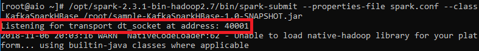

# Spark Local Development Environment Setup with Java and Maven

> TMTOWTDI: Instructions may vary in different environment. This tutorial is based on following environment:
* Windows 10 1803
* JDK 8u112
* IntelliJ IDEA 2018.2.4
* Maven 3.3.9 (The bundled version comes within the IDEA)
* Docker 18.06.1-ce

## Table of Content
<!-- TOC depthFrom:1 depthTo:6 withLinks:1 updateOnSave:1 orderedList:0 -->

- [Spark Local Development Environment Setup with Java and Maven](#spark-local-development-environment-setup-with-java-and-maven)
	- [Table of Content](#table-of-content)
	- [1. JDK Setup](#1-jdk-setup)
		- [1.1 Download JDK](#11-download-jdk)
		- [1.2 Install JDK](#12-install-jdk)
			- [Windows](#windows)
			- [MacOS](#macos)
			- [Linux](#linux)
	- [2. IDE Setup](#2-ide-setup)
		- [2.1 Download and Install IntelliJ IDEA](#21-download-and-install-intellij-idea)
			- [Windows](#windows)
			- [MacOS](#macos)
			- [Linux](#linux)
		- [2.2 Create or Import IntelliJ Project](#22-create-or-import-intellij-project)
			- [Create New Maven Project](#create-new-maven-project)
			- [Import Existing Maven Project](#import-existing-maven-project)
				- [If Project is on Version Control](#if-project-is-on-version-control)
				- [If Project is in local directory](#if-project-is-in-local-directory)
		- [2.3 Import Libraries](#23-import-libraries)
		- [2.4 Write Code](#24-write-code)
		- [2.5 Create Fat Jar](#25-create-fat-jar)
	- [3. Docker Setup](#3-docker-setup)
		- [3.1 Download and Install Docker](#31-download-and-install-docker)
			- [Windows](#windows)
			- [MacOS](#macos)
			- [Linux](#linux)
		- [3.2 Memory Configuration](#32-memory-configuration)
			- [Windows](#windows)
			- [MacOS](#macos)
			- [Linux](#linux)
		- [3.3 Pull Image from Docker Hub](#33-pull-image-from-docker-hub)
		- [3.4 Run the Image](#34-run-the-image)
			- [Windows or MacOS](#windows-or-macos)
			- [Linux](#linux)
	- [4. Run the Spark Job](#4-run-the-spark-job)
		- [4.1 Create Kafka Topic](#41-create-kafka-topic)
		- [4.2 Create HBase Table](#42-create-hbase-table)
		- [4.3 Copy Jar to Container and Submit to Spark](#43-copy-jar-to-container-and-submit-to-spark)
		- [4.4 Publish Data to Kafka](#44-publish-data-to-kafka)
		- [4.5 Check the Result in HBase](#45-check-the-result-in-hbase)
	- [5. Live Debugging](#5-live-debugging)
	- [6. Profiling JVM](#6-profiling-jvm)
		- [Configuration](#configuration)
			- [HBase, Kafka, NiFi, and Cassandra](#hbase-kafka-nifi-and-cassandra)
			- [Spark Driver and Executor](#spark-driver-and-executor)
		- [Java VisualVM](#java-visualvm)
		- [Java Mission Control](#java-mission-control)
	- [7. Clean Up](#7-clean-up)
		- [7.1 Drop HBase Table](#71-drop-hbase-table)
		- [7.2 Remove Docker Container and Image](#72-remove-docker-container-and-image)
		- [7.3 Remove Intellij Project](#73-remove-intellij-project)
	- [Docker Toolbox Setup (TODO)](#docker-toolbox-setup-todo)
	- [VirtualBox Setup (TODO)](#virtualbox-setup-todo)
	- [VMware Setup (TODO)](#vmware-setup-todo)
	- [References](#references)
	- [Appendix](#appendix)
		- [Appendix A - Docker Image Info](#appendix-a-docker-image-info)
		- [Appendix B - Known Issues](#appendix-b-known-issues)
			- [1. Components Stop Working After the Docker Container or the Host Restarts](#1-components-stop-working-after-the-docker-container-or-the-host-restarts)
				- [Symptom](#symptom)
				- [Cause](#cause)
				- [Solution](#solution)
				- [Workarounds](#workarounds)

<!-- /TOC -->

## 1. JDK Setup

### 1.1 Download JDK

Go to https://www.oracle.com/technetwork/java/javase/downloads/java-archive-javase8-2177648.html

Sign in with your Oracle Account. If you don't have one, create an account first

Find Java SE Development Kit 8u112

Select `Accept License Agreement`

Click on the download link that matches your OS


### 1.2 Install JDK

#### Windows

1. Double-click the `jdk-8u112-windows-{version}.exe` file to open the installer. Then follow the instructions the installer provides.

2. Set the environment variables

	1. Go to Advanced system settings > Environment Variables.

	2. Under System Variables. Create the new variable name `JAVA_HOME` and variable value `C:\Program Files\Java\jdk1.8.0_112`

	3. Find the Path variable, add `%JAVA_HOME%\bin` to the Path variable.

#### MacOS

1. From either the Downloads window of the browser, or from the file browser, double click the .dmg file to launch it.

	A Finder window appears containing an icon of an open box and the name of the .pkg file.


2. Double click the package icon to launch the Install app.

	The Install app displays the Introduction window.

	> NOTE: In some cases, a Destination Select window appears. This is a bug, as there is only one option available. If you see this window, select Install for all users of this computer to enable the Continue button.

3. Click Continue.

	The Installation Type window appears.

4. Click Install.

	A window appears that says "Installer is trying to install new software. Type your password to allow this."

5. Enter the Administrator login and password and click Install Software.

	The software is installed and a confirmation window appears.

#### Linux

1. Extract the tarball
``` bash
tar zxf jdk-8u112-linux-{version}.tar.gz -C /opt
```

2. Use `alternatives` to install JDK
``` bash
alternatives --install /usr/bin/java java /opt/jdk1.8.0_112/bin/java 2
alternatives --install /usr/bin/jar jar /opt/jdk1.8.0_112/bin/jar 2
alternatives --install /usr/bin/javac javac /opt/jdk1.8.0_112/bin/javac 2
alternatives --set java /opt/jdk1.8.0_112/bin/java
alternatives --set jar /opt/jdk1.8.0_112/bin/jar
alternatives --set javac /opt/jdk1.8.0_112/bin/javac
```

3. Set environment variable
``` bash
export JAVA_HOME=/opt/jdk1.8.0_112
export PATH=$JAVA_HOME/bin:$PATH
```

## 2. IDE Setup

### 2.1 Download and Install IntelliJ IDEA
Select and download the installation package that matches your OS from the official website: https://www.jetbrains.com/idea/download

#### Windows
Windows 10/8/7/Vista/2003/XP (incl.64-bit)
* Run the IDEA `idea-{version}.exe` file that starts the Installation Wizard.
* Follow all steps suggested by the wizard.

#### MacOS
OS X 10.8.3 or higher
* Download the `idea-{version}.dmg` macOS Disk Image file.
* Mount it as another disk in your system.
* Copy IntelliJ IDEA to your Applications folder.

#### Linux
GNOME or KDE desktop
* Unpack the IDEA `idea-{version}.tar.gz` file using the following command:
```
tar -xzf idea-{version}.tar.gz
```
* Run `idea.sh` from the bin subdirectory.

### 2.2 Create or Import IntelliJ Project

Launch the IntelliJ IDEA. The welcome window will show up.


> OPTIONAL: To use different Maven version, go to File > Settings > Build, Execution, Deployment > Build Tools > Maven. Change the Maven home directory.


#### Create New Maven Project

Create a new project by selecting Create New Project on the welcome window, or File > New > Project if the IDE is open. Then select Maven, set JDK version and click Next.


Specify the GroupId, ArtifactId and Version, then click Next.


Name the project and select location, then click Finish.


IntelliJ should make a new project with a default directory structure.


Change IntelliJ Settings
Go to File > Project Structure > Project. Verify Project SDK and Project language level are set to Java version.


Go to File > Project Structure > Modules. Verify Language level is set to Java version.


#### Import Existing Maven Project

##### If Project is on Version Control

Select corresponding version control by clicking on `Check out from Version Control` on the welcome window,


or go to File > New > Project from Version Control if the IDE is open.


Take Git as example, provide Git URL and click Clone.


##### If Project is in local directory

Click on `Import Project` on the welcome window,


or go to File > New > Project from Existing Sources if the IDE is open.


Select the existing project directory, click OK


Select Import project from external model, choose Maven, click Next


Click Next


Click Next


Click Next


Click Finish


### 2.3 Import Libraries

Edit the pom.xml file in the project directory as needed.


If the Auto-Import is not enabled, a floating window will show up on the bottom-right side. Click `Import Changes` to import libraries.


> OPTIONAL: To enable Auto-Import, click `Enable Auto-Import` or go to File > Settings > Build, Execution, Deployment > Build Tools > Maven > Importing. Verify that `import Maven projects automatically` is Checked.


### 2.4 Write Code

Expand the folder `src/main/java` in the project directory.

If you created a new project, right-click on folder and select New > Java Class. Name the class: KafkaSparkHBase.java


If you imported the project from an existing source, double-click on the class name to open the class for editing


> NOTE: Do not worry about the red lines for now.

### 2.5 Create Fat Jar

Go to Maven Projects > {Project Name} > Lifecycle. Double click on package. This will create a compiled jar under target in the project directory.


> NOTE: The red lines should disappear after you close and reopen the IntelliJ IDEA. If not, go to Maven Projects and try the the Reimport button:


## 3. Docker Setup

### 3.1 Download and Install Docker

#### Windows
Windows 10 64bit: Pro, Enterprise or Education (1607 Anniversary Update, Build 14393 or later)
* Log in and download the `Docker for Windows Installer.exe` at https://store.docker.com/editions/community/docker-ce-desktop-windows
* Follow the instructions in https://docs.docker.com/docker-for-windows/install/ to install Docker for Windows

#### MacOS
OS X El Capitan 10.11 and newer
* Log in and download the `Docker.dmg` macOS Disk Image file at https://store.docker.com/editions/community/docker-ce-desktop-mac
* Follow the instructions in https://docs.docker.com/docker-for-mac/install/ to install Docker for Mac

#### Linux
OS requirement varies
* Select the corresponding Linux distribution in the `Linux` dropdown menu on the left side in the link https://docs.docker.com/install/,
* Follow the instructions in the webpage to install Docker for Linux

> NOTE: For previous OS versions, use Docker Toolbox (legacy): https://docs.docker.com/toolbox/overview/

### 3.2 Memory Configuration

#### Windows

Right click on the Docker icon. Select Settings.


Select Advanced tab, adjust the memory limit to 4 - 8 GB


#### MacOS

Click on the Docker icon in the menu bar. Select Preferences.


Select Advanced tab, adjust the memory limit to 4 - 8 GB


#### Linux

No configuration needed for Linux

### 3.3 Pull Image from Docker Hub

Open a console. Pull the Docker image https://hub.docker.com/r/ccbt87/aio/
```
docker pull ccbt87/aio
```
> Refer to Appendix A for the details about this image.

### 3.4 Run the Image

Use docker run command to run the image. Specify the hostname and the name for the container as needed. If not specified, a short form of UUID will be used as the hostname, and a random name will be given to the container. For demo purpose, this tutorial use `aio` for both names.

#### Windows or MacOS

Docker for Mac and Windows cannot route traffic to Linux containers. Use the following workaround:
* To connect to a container from the Mac or Windows, run the image using either one of the following commands and then use localhost:{port} to access the service in the container.
  * Use `-p` or `--publish` to publish ports on the container to specific ports on the host.
  ```
	docker run --hostname aio --name aio -it -p 2181:2181 -p 4040:4040 -p 6667:6667 -p 7077:7077 -p 8080:8080 -p 8081:8081 -p 8765:8765 -p 9042:9042 -p 9090:9090 -p 16000:16000 -p 16010:16010 -p 16020:16020 -p 16030:16030 -p 18080:18080 -p 40001-40011:40001-40011 ccbt87/aio
  ```
  * Use `-P` to exposes pre-defined ports on the container to random ports on the host. (Ports 2181 4040 6667 7077 8080 8081 8765 9042 9090 16000 16010 16020 16030 18080 and 40001 to 40011 were defined in the Dockerfile when building this Docker image)
  ```
  docker run --hostname aio --name aio -it -P ccbt87/aio
  ```

* To connect from a container to a service on the host

  * The host has a changing IP address (or none if it has no network access). From Docker 18.03 onwards the recommendation is to connect to the special DNS name `host.docker.internal`, which resolves to the internal IP address used by the host. This is for development purpose and will not work in a production environment outside of Docker for Mac or Windows.
  * The gateway is also reachable as `gateway.docker.internal`.

#### Linux

No port mapping needed on Linux
```
docker run --hostname aio --name aio -it ccbt87/aio
```

After the docker run command finished, the console will be attached to the shell of the container as the `-it` option tells Docker to run the container in foreground mode.


Use following docker command in the host console to open as many new container shell as you want.
```
docker exec -it aio /bin/bash
```

## 4. Run the Spark Job

### 4.1 Create Kafka Topic

In the container shell, create a topic
```
/opt/kafka_2.11-1.1.1/bin/kafka-topics.sh --create --zookeeper aio:2181 --replication-factor 1 --partitions 1 --topic test-topic
```


### 4.2 Create HBase Table

In the container shell, send create command to HBase shell
```
echo "create 'test-table', 'word-count'" | /opt/hbase-2.0.0/bin/hbase shell
```

> OPTIONAL: you can use the `init_hbase_table.sh` to create or drop the HBase table. Refer to Appendix A for the usage


### 4.3 Copy Jar to Container and Submit to Spark

In the host console, copy the jar file to the container.
```
docker cp /path_to_jar/sample-KafkaSparkHBase-1.0-SNAPSHOT.jar aio:/root/
```

In the container shell, use spark-submit to submit the Spark job, with necessary configurations. You may also place the configurations in a file and read it from the file using the `--properties-file` flag when submitting the job.
```
/opt/spark-2.3.1-bin-hadoop2.7/bin/spark-submit --name "test-app" --master spark://aio:7077 --class KafkaSparkHBase /root/sample-KafkaSparkHBase-1.0-SNAPSHOT.jar
```

Once you see the time elapses, the Spark job is running.


### 4.4 Publish Data to Kafka

In the container shell, use `kafka-console-producer.sh`
```
/opt/kafka_2.11-1.1.1/bin/kafka-console-producer.sh --broker-list aio:6667 --topic test-topic
```

Enter some messages to Kafka:


In the container shell in which the Spark job is running, you should see the word counts:


### 4.5 Check the Result in HBase

In the container shell, send scan command to HBase shell
```
echo "scan 'test-table'" | /opt/hbase-2.0.0/bin/hbase shell
```

You should see the word counts:


## 5. Live Debugging

In the IntelliJ, set breakpoints in your code. Then go to Run > Edit Configurations


Then click the + button at the upper-left and add a new remote configuration. Fill the host and port fields. For example, use the host `localhost` and port `40001`.


In the container shell, submit the Spark job with the `--conf` flag to set `spark.driver.extraJavaOptions` to the same as the `Command line arguments for remote JVM` in the IntelliJ remote configuration window.

```
/opt/spark-2.3.1-bin-hadoop2.7/bin/spark-submit --conf spark.driver.extraJavaOptions=-agentlib:jdwp=transport=dt_socket,server=y,suspend=n,address=40001 --class KafkaSparkHBase /root/sample-KafkaSparkHBase-1.0-SNAPSHOT.jar
```

Or write the configuration to a file and read it from the file using the `--properties-file` flag when submitting the job.

```
/opt/spark-2.3.1-bin-hadoop2.7/bin/spark-submit --properties-file spark.conf --class KafkaSparkHBase /root/sample-KafkaSparkHBase-1.0-SNAPSHOT.jar
```

Once you submitted the job, it will listen on the port 40001



Go back to IntelliJ and hit the `Debug` button immediately after submitting your Spark job, the `Console` tab will show the connection info, the `Debugger` will attach and Spark will stop at the breakpoints you set.


Under the `Debugger` tab, you can inspect the values of live variables within the Spark job.


## 6. Profiling JVM

### Configuration

Java Management Extensions (JMX) API is used to expose the Java applications for remote management (profiling)

#### HBase, Kafka, NiFi, and Cassandra

Following properties were included in the `config-all.sh` script in the Docker images, and will be applied to HBase, Kafka, NiFi, and Cassandra when running the Docker image. No further configuration needed.

```
-XX:+UnlockCommercialFeatures \
-XX:+FlightRecorder \
-Dcom.sun.management.jmxremote=true \
-Dcom.sun.management.jmxremote.authenticate=false \
-Dcom.sun.management.jmxremote.ssl=false \
-Dcom.sun.management.jmxremote.port={port} \
-Dcom.sun.management.jmxremote.rmi.port={port} \
-Dcom.sun.management.jmxremote.local.only=false \
-Djava.rmi.server.hostname=localhost
```

Use following ports for JMX connections

| Component | Port |
| --- | --- |
| NiFi | 40004 |
| Kafka | 40005 |
| Hbase Master | 40006 |
| Cassandra | 40011 |

> NOTE: In standalone mode HBase runs all the daemons including HBase Master, HBase RegionServer, and the ZooKeeper within a single JVM. JMX connection can only be set up for HBase Master OR HBase RegionServer in this case.

#### Spark Driver and Executor

For Spark Driver and Executor, the same properties need to be included in the Spark Configuration when submitting the spark job.

For example, include the properties for both of the `spark.driver.extraJavaOptions` and `spark.executor.extraJavaOptions` in the `spark.conf` file:


In the container shell, read it from the file using the `--properties-file` flag when submitting the job.

```
/opt/spark-2.3.1-bin-hadoop2.7/bin/spark-submit --properties-file spark.conf --class KafkaSparkHBase /root/sample-KafkaSparkHBase-1.0-SNAPSHOT.jar
```

Once submitted, JMX connection is available on the port that is specified in the `spark.conf` file.

### Java VisualVM


Enter `jvisualvm` in the host console to launch the Java VisualVM.

Once the Java VisualVM is open, click on the `Add JMX Connection` icon, type in hostname and port, and click `OK`


The connection will be added in the Applications tab on the left side. Double click on the connection, the JVM monitoring information will show up on the right side.


> NOTE: the Profiler tab is not available for remote applications, use the Sampler tab as an alternative.

### Java Mission Control

Enter `jmc` in the host console to launch the Java Mission Control.

Once the Java Mission Control is open, click on the `Create a new custom JVM connection` icon, type in hostname and port, and click on `Test connection` to test the connection. If the `Status` shows `OK`, click `Finish`


The connection will be added in the JVM Browser tab on the left side. Double click on the `MBean Server` under the connection, the JVM monitoring information will show up on the right side.


Use the `Flight Recorder` for profiling.

## 7. Clean Up

### 7.1 Drop HBase Table

In the container shell, run following command to disable and drop all of the HBase tables

```
echo -e "disable_all '.*'\ny\ndrop_all '.*'\ny" | /opt/hbase-2.0.0/bin/hbase shell -n
```

### 7.2 Remove Docker Container and Image

Use `docker ps` to check the existence of any running container.

```
docker ps
```

Use `docker stop {container name or id}` to stop the running container.

```
docker stop aio
```

Use `docker ps -a` to check the existence of any container.

```
docker ps -a
```

Use `docker rm {container name or id}` to remove the stopped container.

```
docker rm aio
```

Use `docker images` to list the local images.

```
docker images
```

Use `docker rmi {image name or id}` to remove the local image.

```
docker rmi ccbt87/aio
```

### 7.3 Remove Intellij Project

To remove the Intellij project, simply delete the project directory on the disk.

## Docker Toolbox Setup (TODO)


## VirtualBox Setup (TODO)


## VMware Setup (TODO)


## References
https://hortonworks.com/tutorial/setting-up-a-spark-development-environment-with-java/

https://github.com/ccbt87/sample-KafkaSparkHBase

https://docs.docker.com/docker-for-mac/networking/

https://spark.apache.org/docs/latest/monitoring.html

https://community.hortonworks.com/content/supportkb/150580/how-to-connect-jconsole-to-spark-driver-and-execut.html

https://community.hortonworks.com/questions/180008/enabling-jmx-for-nifi.html

https://docs.datastax.com/en/cassandra/3.0/cassandra/configuration/secureJmxAuthentication.html

https://hbase.apache.org/metrics.html

https://github.com/wurstmeister/kafka-docker/wiki#why-do-kafka-tools-fail-when-jmx-is-enabled

## Appendix
### Appendix A - Docker Image Info
Following components were included in the latest Docker image `ccbt87/aio`:

| Component | Version | Binary Location | Port |
| --- | --- | --- | --- |
| Kafka | 1.1.1 | /opt/kafka_2.11-1.1.1 | Listener 6667 |
| Spark* | 2.3.1 | /opt/spark-2.3.1-bin-hadoop2.7 | Master 7077 <br> Master Web UI 8080 <br> Worker Web UI 8081 <br> Application Web UI 4040 <br> History Server Web UI 18080 |
| HBase | 2.0.0 | /opt/hbase-2.0.0 | Master 16000 <br> Master Web UI 16010 <br> RegionServer 16020 <br> RegionServer Web UI 16030 |
| Zookeeper* | 3.4.10 | | Client Port 2181 |
| Cassandra | 3.11.3 | /opt/apache-cassandra-3.11.3 | Client Port 9042 |
| NiFi | 1.7.0 | /opt/nifi-1.7.0 | Web UI 9090 |
| Phoenix Query Server | 5.0.0 | /opt/apache-phoenix-5.0.0-HBase-2.0-bin | Listener 8765 |

This Docker image uses the Oracle JDK version: 1.8.0_112 (JAVA_HOME=/opt/jdk1.8.0_112)

\* The Spark is pre-built for Hadoop version 2.7.3 which does not align with the Hadoop version 3.1.1 in HDP 3.0.1 and HDF 3.2.0

\* The Zookeeper version 3.4.10 comes within the HBase standalone mode does not align with the Zookeeper version 3.4.6 in HDP 3.0.1 and HDF 3.2.0

Scripts under `/root`:

`config-all.sh` is used for config hostname, ports, and other configurations for NiFi, Kafka, Cassandra, and HBase

`start-all.sh` is used for start all the components

`stop-all.sh` is used for stop all the components

`init-hbase-table.sh` is used for create or drop HBase table:

Supply no argument will first try to disable and drop the default table name `tenantid_data`, and then create the same table name with three column families `e`, `U`, and `S`
```
./init-hbase-table.sh
```
Supply one argument will try to disable and drop the specified table name
```
./init-hbase-table.sh table_name
```
Supply two arguments will first try to disable and drop the specified table name, and then create the same table name with the column family name(s)
```
./init-hbase-table.sh table_name columnfamily_name [columnfamily_name2 columnfamily_name3]
```

### Appendix B - Known Issues
#### 1. Components May Stop Working After the Docker Container or the Host Restarts

##### Symptom

* The JVM Process `HMaster` disappeared. HBase Master, HBase RegionServer, and ZooKeeper do not work.
* The JVM Process `Kafka` disappeared. Kafka does not work.
* The JVM Process `NiFi` and/or `RunNiFi` disappeared. NiFi does not work.

##### Cause

* Time change cause ZooKeeper Session expiring
* Unknown cause for NiFi

##### Solution

None

##### Workarounds

1. Restart everything using the scripts under `/root`
```
./stop-all.sh && ./start-all.sh
```

2. Add `--rm` option when running the Docker image
```
docker run --hostname aio --name aio --rm -it -p 2181:2181 -p 4040:4040 -p 6667:6667 -p 7077:7077 -p 8080:8080 -p 8081:8081 -p 8765:8765 -p 9042:9042 -p 9090:9090 -p 16000:16000 -p 16010:16010 -p 16020:16020 -p 16030:16030 -p 18080:18080 -p 40001-40011:40001-40011 ccbt87/aio
```
> NOTE: With the `--rm` flag Docker will remove the container when it exits. Make sure to backup the data in the container if there is any.
