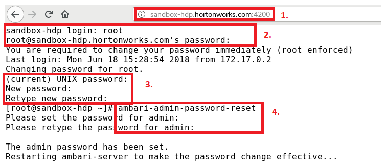
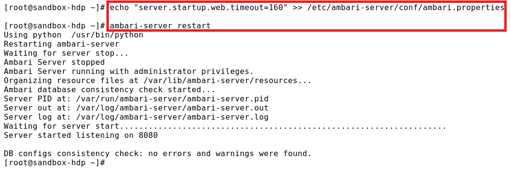

## Prerequisites
* HDP and/or HDF have/has been deployed

## First Things First
Add `HOST_IP sandbox-hdp.hortonworks.com sandbox-hdf.hortonworks.com` to the `hosts` file.

## Access HDP
The first time access HDP requires to set up the password for the Ambari admin account.

1. Open `http://sandbox-hdf.hortonworks.com:4200` in web browser
2. Log in to the shell web client (the shell of the host of HDP) using credentials: `root/hadoop`
3. You are required to change your password immediately. Enter the root password `hadoop`. Then enter a new password twice for the root account.
4. Enter the command `ambari-admin-password-reset`, and enter a new password twice for the Ambari admin account.

Once the password is set, the ambari-server will restart.

* You may get the error message `Server not yet listening on http port 8080 after 50 seconds.` on low performance machine.

If you get this error message, enter the command `echo "server.startup.web.timeout=160" >> /etc/ambari-server/conf/ambari.properties` to increase the timeout value. And then enter the command `ambari-server restart` to restart the ambari-server

Once the ambari-server started successfully. Follow the steps to access the HDP
1. Open `http://sandbox-hdf.hortonworks.com:8080` in web browser
2. Log in to the Ambari Server using the default username/password: `admin/admin`

## Access HDF
1. Open `http://sandbox-hdf.hortonworks.com:8080` in web browser
2. Log in to the Ambari Server using the default username/password: `admin/admin`

## References
* Learning the Ropes of the HDP Sandbox
https://hortonworks.com/tutorial/learning-the-ropes-of-the-hortonworks-sandbox/
* Learning the Ropes of the HDF Sandbox
https://hortonworks.com/tutorial/getting-started-with-hdf-sandbox/
